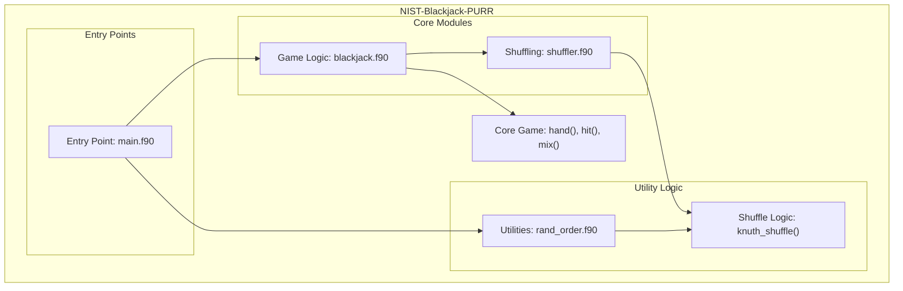

# NIST Blackjack Simulation test test test

## Overview

This repository provides a simplified implementation of a Blackjack game, designed for both simulation and randomization tasks. The project is written in Fortran and includes core components for shuffling cards, simulating gameplay, and determining winners. Additionally, it includes functionality for general-purpose integer randomization, making it useful beyond the context of card games. The application is modular, enabling easy customization, debugging, and integration into larger systems.

## Key Features

- **Full Blackjack Gameplay Simulation**: Includes logic for player and dealer actions, card drawing, score calculation, and winner determination.
- **Shuffling Algorithms**: Implements the Knuth (Fisher-Yates) shuffle algorithm for robust randomization of card decks or integer sequences.
- **Debug Mode**: Allows for manual card inputs during gameplay for testing and debugging purposes.
- **Command-line Interaction**: Supports command-line arguments for configuration, such as enabling debug mode or specifying randomization parameters.
- **Modular Design**: Features well-structured modules for managing game logic (`game`), shuffling (`shuffler`), and randomization tasks (`randint`).
- **Cross-Language Integration**: Includes both Fortran-based logic and C-based components, enabling compatibility with various development environments.
- **Build and Test Integration**: Configurable build systems (CMake, Meson) and testing frameworks are set up for seamless development and quality assurance.

# Layout and Architecture
```
└── 7aae29ca-ed72-4738-9142-c0128699d09a
    └── NIST-Blackjack-PURR
        ├── .github                    # GitHub-specific configurations
        │   └── workflows
        │       └── ci.yml             # CI pipeline for automated testing
        ├── CMakeLists.txt             # CMake build configuration file
        ├── CMakePresets.json          # Preset configurations for CMake builds
        ├── LICENSE                    # License for the project
        ├── app                        # Contains the main applications
        │   ├── main.f90               # Primary program for playing Blackjack
        │   └── rand_order.f90         # Program for shuffling integers
        ├── fpm.toml                   # Fortran package manager configuration
        ├── meson.build                # Meson build configuration file
        ├── src                        # Core source code modules
        │   ├── blackjack.c            # C integration for higher performance tasks
        │   ├── blackjack.f90          # Blackjack game logic and core mechanics
        │   └── shuffler.f90           # Knuth shuffle implementation (used for card shuffling)
        └── tests                      # Test files for validation
            ├── test_hit.cmake         # CMake test for 'hit' subroutine
            ├── test_hit.py            # Python test for 'hit' subroutine
            └── y.asc                  # Possibly supporting data for tests (no description available)
```




## Usage Examples

### Build

#### Build using CMake
To build the project using CMake:
```bash
mkdir build
cd build
cmake ..
make
```

#### Build using Meson
To build the project using Meson:
```bash
meson setup builddir
ninja -C builddir
```

### Test

#### Running tests with CMake
To run the tests with CMake:
```bash
ctest
```

#### Running tests with Meson
To run the tests with Meson:
```bash
meson test -C builddir
```

#### Running Python tests
To test the `hit` subroutine interactively:
```bash
python3 tests/test_hit.py path/to/executable
```

### Run

#### Run the Fortran Blackjack game
To run the main Fortran implementation of Blackjack:
```bash
./f_blackjack
```

#### Run the C Blackjack game
To run the C implementation of Blackjack:
```bash
./c_blackjack
```

#### Debug mode
To enable debug mode for player-driven card input:
```bash
./f_blackjack -d
```


# Key Feature Implementation Deep Dive

## 1. Blackjack Gameplay Mechanics (`blackjack.f90` in the `game` module)

### Purpose:
This module implements the core mechanics of the Blackjack game. It includes functions and subroutines to simulate a hand of Blackjack, process player and dealer moves, determine victory conditions, and handle busts.

### Implementation:
- **`hand` Function:**
  - Handles the main gameplay loop. It starts by dealing initial cards to the player and dealer using the `hit` subroutine.
  - Continuously asks the player if they'd like to "hit" or "stay." If the player chooses "hit," the `hit` subroutine is invoked to draw a card and update the player's total score and ace count.
  - Resolves victory conditions:
    - Player blackjack, busts, or automatic wins.
    - Dealer plays after the player decides to stay. The dealer keeps hitting until reaching a score of 17 or busting.
  - Returns the outcome:
    - `win = 0`: Dealer wins.
    - `win = 1`: Player wins.
    - `win = 2`: Push (tie).

- **`hit` Subroutine:**
  - Draws a card from the deck and updates the player's or dealer's total score and ace count.
  - Handles the special rule of aces counting as 1 or 11 based on the total score exceeding 21.

- **`mix` Subroutine:**
  - Initializes a standard deck of 52 cards with appropriate values for Blackjack (e.g., face cards as `10`, aces as `11`).
  - Invokes the `knuth_shuffle` subroutine from the `shuffler` module to shuffle the deck.

### Integration:
This module ties together the gameplay logic, ensuring the deck is shuffled beforehand and maintaining the rules of Blackjack during play.

---

## 2. Card-Shuffling Implementation (`shuffler.f90` in the `shuffler` module)

### Purpose:
The `shuffler` module provides an implementation of the Knuth shuffle (also known as Fisher-Yates shuffle) to ensure randomness in arrays. It is crucial for shuffling the deck in Blackjack and is reusable for other array randomization tasks.

### Implementation:
- **`knuth_shuffle` Subroutine:**
  - Iterates over the array from the last element to the second.
  - Selects a random index (`j`) between 1 and the current element (`i`).
  - Swaps the current element (`i`) with the randomly selected element (`j`) to ensure uniform randomness.

### Integration:
The `knuth_shuffle` subroutine is invoked by the `mix` subroutine in the `game` module to shuffle the deck of cards.

---

## 3. Main Blackjack Interface (`main.f90` in the `blackjack` program)

### Purpose:
This program serves as the entry point for the user. It initializes the game deck, processes command-line arguments, manages debug mode, and initiates the gameplay.

### Implementation:
- Initializes the random number generator using `random_init`.
- Sets the `debug` flag based on the presence of `-d` as a command-line argument.
- Calls the `mix` subroutine to prepare the shuffled deck.
- Invokes the `hand` function to simulate the gameplay and determine the winner.

### Integration:
This program ties together the gameplay mechanics (`game` module) and user interaction, providing a straightforward interface to play Blackjack.

---

## 4. Integer Array Randomization (`rand_order.f90` in the `randint` program)

### Purpose:
This utility program demonstrates the general applicability of the `knuth_shuffle` subroutine for tasks beyond Blackjack. It allows users to shuffle any sequence of integers.

### Implementation:
- Reads the maximum integer value (`N`) as a command-line argument.
- Initializes an integer sequence array (`A`) from 1 to `N`.
- Calls the `knuth_shuffle` subroutine to randomize the order of integers in the array.

### Integration:
This program highlights the modular design of the `shuffler` module, showcasing its ability to handle general-purpose array shuffling.

---

## Summary:
The repo is well-structured, with modular design principles ensuring reusability and clarity. The Blackjack gameplay mechanics and shuffling algorithm are tightly coupled to deliver a realistic gaming experience, and their general-purpose applications (e.g., integer array randomization) are evident in the `rand_order.f90` program.


# Implemented User Stories

## [ ] Core Blackjack Gameplay

- [ ] **As a player**, I want to draw a card during my turn, so that I can increase my hand value, which requires the `hit` subroutine to process card draws while updating the `total` and `aces`.
- [ ] **As a player**, I want the dealer to take their turn with automatic actions, so that the game proceeds according to standard rules, which requires the `hand` function to simulate dealer logic.
- [ ] **As a player**, I want to decide whether to "hit" or "stay," so that I can strategize for either increasing or maintaining my score, which requires a decision point within the `hand` function.
- [ ] **As a player**, I want the game to declare a winner at the end of each round, so that I know the outcome of my actions, which requires the `hand` function to determine results based on Blackjack rules.
- [ ] **As a player**, I want the game to handle special cases like Blackjack and busts, so that gameplay follows standard rules, which requires conditional logic in the `hand` function.

## [ ] Card Deck Management

- [ ] **As a game system**, I want to shuffle the deck of cards before each game, so that the gameplay remains fair and random, which requires the `mix` subroutine.
- [ ] **As a developer**, I want to use the Knuth shuffle algorithm for shuffling cards, so that the shuffling is efficient and unbiased, which requires the `knuth_shuffle` subroutine.
- [ ] **As a player**, I want to use a standard 52-card deck for gameplay, so that the rules remain familiar and aligned with traditional Blackjack, which requires the `mix` subroutine to initialize the deck.

## [ ] Debugging and Development

- [ ] **As a developer**, I want to enable a debug mode for manual card input, so that I can test specific game scenarios, which requires the `debug` attribute in the `blackjack.f90` module.
- [ ] **As a developer**, I want to simulate the game repeatedly with the same random seed, so that I can replicate and verify gameplay results, which requires the `random_init` subroutine.
- [ ] **As a tester**, I want to access Python-based test files for verifying subroutines, so that I can validate correctness across environments, which requires integration with `test_hit.py`.

## [ ] Integer Shuffle Program (Randint)

- [ ] **As a user**, I want to shuffle a list of integers in random order, so that I can randomize team assignments or sequence operations, which requires the `knuth_shuffle` subroutine to operate on an integer array.
- [ ] **As a user**, I want to specify the range of integers for shuffling, so that I can customize the possible values, which requires command-line input for the `rand_order.f90` program.

## [ ] Command-line Interaction

- [ ] **As a developer**, I want to pass command-line arguments to the blackjack game, so that I can configure options like enabling debug mode, which requires the `get_command_argument` subroutine.
- [ ] **As a user**, I want to view help or usage instructions through the command line, so that I understand how to interact effectively, which requires handling argument parsing for the `main.f90` program.


# Dependencies


## Intrinsic

Standard Fortran intrinsic modules and functions.
- **iso_fortran_env**
  - `ALL`
- **iso_c_binding**
  - `c_int`
## Internal

Modules and functions defined within this project that are accessed in a different module or program.
- **shuffler**
  - `knuth_shuffle`
- **game**
  - `debug`
  - `hand`
  - `mix`
## External Functions

External (non-Fortran, bound with the C ABI) functions called by this project.
- `hit`
- `knuth_shuffle`
- `mix`
