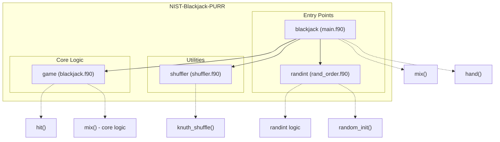

# NIST Blackjack Simulation Test Test Tes Aug 8-26

## Overview
The NIST Blackjack Simulation is a lightweight and straightforward Fortran-based implementation of a simplified Blackjack game. It provides a fun and educational exploration of card-based algorithms, including shuffling using the Knuth (Fisher-Yates) Shuffle and essential gameplay logic. The repository also offers a utility for shuffling integer arrays for general-purpose scenarios. Designed with modularity in mind, the project is structured to separate core functionalities like shuffling, gameplay, and debugging, making it a great resource for learning or extending card-based simulations.

## Key Features
- **Blackjack Game Simulation**: Implements the main rules of Blackjack, including player and dealer mechanics, score evaluation, and win/loss determination.
- **Card Shuffling Algorithms**: Features the Knuth Shuffle algorithm for ensuring random and efficient shuffling of card decks.
- **Debug Mode**: Offers a debug mode to manually input cards for controlled game scenarios.
- **Command-Line Integer Shuffler**: Includes a standalone utility for shuffling lists of integers, ideal for scenarios like randomizing team orders.
- **Modular Fortran Codebase**: Clear separation of concerns across modules for shuffling, gameplay logic, and utility functions.
- **Cross-Language Integration**: A mix of Fortran and C demonstrates interoperability and expands possibilities for further development.

# Layout and Architecture
```
└── 1a72bfb5-d7f3-4657-b5f6-149d8784e56c
    └── NIST-Blackjack-PURR
        ├── .github
        │   └── workflows
        │       └── ci.yml               # CI configuration for automated testing/builds
        ├── CMakeLists.txt               # CMake project configuration file
        ├── CMakePresets.json            # Presets for CMake build system
        ├── LICENSE                      # Project license
        ├── app/                         # Application entry points
        │   ├── main.f90                 # Main program for the Blackjack game
        │   └── rand_order.f90           # Program to shuffle integers using the Knuth Shuffle
        ├── fpm.toml                     # Fortran Package Manager configuration
        ├── meson.build                  # Meson build system configuration
        ├── src/                         # Source modules for core functionality
        │   ├── blackjack.c              # C code (if any) for supporting the Blackjack implementation
        │   ├── blackjack.f90            # Implements the core Blackjack game logic
        │   └── shuffler.f90             # Implements the Knuth Shuffle algorithm
        └── tests/                       # Test scripts and resources
            ├── test_hit.cmake           # CMake test for the "hit" subroutine
            ├── test_hit.py              # Python test for the "hit" subroutine
            └── y.asc                    # Test asset file (unspecified purpose)
```




# Usage Examples

## Build

### Compile the Blackjack game
To compile the Blackjack game using CMake:
```bash
mkdir build
cd build
cmake ..
make
```

## Run

### Execute the Blackjack game
To run the Blackjack game program after compiling:
```bash
./game
```
This command starts a simplified Blackjack game. The program shuffles the deck and simulates a round of Blackjack, comparing the player's and dealer's scores.

### Shuffle integers with `rand_order`
To shuffle a sequence of integers, use:
```bash
./rand_order 10
```
Here, `10` is the maximum integer, and the program will print a shuffled sequence ranging from 1 to 10.

## Test

### Run CMake tests
To execute all tests defined in the `CMakeLists.txt` file:
```bash
ctest
```

### Python-driven testing
Use the `test_hit.py` script to test the `hit` function:
```bash
python3 test_hit.py ./game
```
This script interacts with the `./game` executable, simulating player input dynamically.


### Key Feature Implementation Deep Dive

---

#### 1. **The `hand` Function**
The `hand` function in `blackjack.f90` serves as the central gameplay logic in the blackjack simulation. It handles core player-dealer interactions, evaluates win/loss conditions, and integrates seamlessly with auxiliary subroutines and modules like `hit` and `mix`. Here's a breakdown:

- **Initialization**: Initializes player (`P`) and dealer (`D`) totals, ace counts (`PACE` and `DACE`), and other state variables. Cards are dealt initially to both the player and dealer via the `hit` subroutine.
- **Gameplay Loop**:
    - Prompts the player for actions ("Hit? y/n") until they decide to hold or exceed a limit.
    - Dealer continues drawing cards until its total meets or exceeds 17, per typical blackjack rules.
- **Win/Loss Evaluation**:
    - Checks if the player or dealer gets a blackjack, busts, or achieves a score higher than the adversary's total.
    - Returns a result code—`1` for player win, `2` for a push (tie), `0` for dealer win.
- **Integration**:
    - Calls `hit` to process card draws and modify scores dynamically.
    - Relies on shuffled cards (`cards` array) provided by `mix`.
- **Debug Mode**: Allows manual card input for development/testing purposes, toggled using the `debug` flag.

The `hand` function is the core feature responsible for driving the game round logic, melding inputs, interactions, and rules.

---

#### 2. **The `hit` Subroutine**
The `hit` subroutine performs a single "hit" operation in blackjack, dynamically manipulating player/dealer scores based on the drawn card. It adjusts ace values to prevent busts over `21`.

- **Arguments**:
    - `total`: Tracks the current score of the player/dealer.
    - `aces`: Counts the number of aces held.
    - `i`: The pointer to the current card in the shuffled array.
    - `cards`: The shuffled deck.
- **Core Logic**:
    - Updates the `total` with the drawn card's value.
    - If an ace (`11`) is drawn, it increases the `aces` counter.
    - Avoids busts by converting high-value aces (`11` points) to `1` point as needed.
    - Increments the card index (`i`) for subsequent draws.
- **Debug Mode**:
    - In debug mode, allows manual input of card values for testing purposes instead of drawing cards automatically.
- **Integration**:
    - Works seamlessly with the `hand` function to orchestrate individual hit actions during the game.

This subroutine is essential for mimicking player and dealer actions, with logic to handle ace-related adjustments—a key component in blackjack gameplay.

---

#### 3. **The `mix` Subroutine**
The `mix` subroutine shuffles the deck of cards using Knuth's (Fisher-Yates) shuffle algorithm. This guarantees randomization, which is crucial for the integrity and unpredictability of game rounds.

- **Process**:
    - Represents a standard 52-card deck preset with ranks (`2` to `11`) distributed across suits.
    - Invokes the `knuth_shuffle` subroutine from the `shuffler` module to permute the deck in place.
- **Integration**:
    - Called in the initialization phase of the game (via `main.f90`) to prepare a randomized `cards` array passed to the `hand` function.
- **High-Level Workflow**:
    - Deck is initialized and passed to `knuth_shuffle`, ensuring randomness.
    - Provides a shuffled deck for subsequent gameplay logic in `hand`.

This subroutine ensures that every game benefits from a fair and random card distribution.

---

#### 4. **The `knuth_shuffle` Subroutine**
Implemented in `shuffler.f90`, the `knuth_shuffle` subroutine is a reliable and efficient method for shuffling arrays. It plays a key role in ensuring gameplay randomness.

- **Algorithm**:
    - Loops through elements of the input array (`A`) from the last to the second.
    - Randomly swaps the current element with another before it, leveraging the `random_number` intrinsic function for randomness.
- **Arguments**:
    - Operates directly on integer arrays (e.g., the deck of cards in `mix`).
- **Core Contribution**:
    - Powers the randomness in card distribution needed for blackjack gameplay.
- **Integration**:
    - Called by `mix` in the `game` module, ensuring shuffled decks are available whenever a game starts.

The `knuth_shuffle` is foundational for maintaining fairness and unpredictability in the blackjack simulation.

---

#### 5. **The `blackjack` Program**
The `blackjack` program (`main.f90`) ties all the modules (e.g., `game`, `shuffler`) together into a cohesive gameplay experience.

- **Workflow**:
    - Initializes the random number generator for consistent shuffling.
    - Checks for debug mode flags (`-d`) via command-line arguments.
    - Calls `mix` to prepare the deck and passes the shuffled cards to `hand` for processing.
    - Outputs results of the game round.
- **Role in Modular Design**:
    - Serves as the entry point, coordinating interactions between modules (`game` and `shuffler`).
    - Simplifies debugging and testing by toggling debug mode.

As a high-level orchestrator, the `blackjack` program is responsible for ensuring consistency and smooth interaction between modular features.

---

### Summary
This deep dive examined key features—`hand`, `hit`, `mix`, `knuth_shuffle`, and the `blackjack` program—and their integral roles in the repo's design. Each component is optimized for modularity and interaction, offering clear pathways for improvement (e.g., extending card types or rules) and scalability. Together, these features create a robust foundation for the blackjack simulation.


# Implemented User Stories

## Core Blackjack Game (`game` module)
- [ ] **As a player**, I want to play a simplified game of Blackjack, so that I can compare my hand with the dealer's and determine the winner, which requires the `hand` function to process gameplay logic and scoring.
- [ ] **As a player**, I want the dealer to follow standard Blackjack rules for drawing cards, so that the game adheres to expected mechanics, which requires the `hit` subroutine to update the dealer's scores dynamically.
- [ ] **As a player**, I want to draw additional cards ("hit") during my turn, so that I can try to improve my score without exceeding 21, which requires both the `hit` subroutine and interactive decision-making.
- [ ] **As an engineer**, I want to debug the game by manually specifying card inputs, so that I can test edge cases directly, which requires setting `debug` mode via command-line arguments.
- [ ] **As a player**, I want to automatically reshuffle the deck, so that the cards are randomized before every game, which requires the `mix` subroutine to implement the Knuth algorithm.

## Deck Shuffling (`shuffler` module)
- [ ] **As an engineer**, I want to shuffle an arbitrary array reliably, so that I can randomize game elements using the Knuth shuffle algorithm, which requires the `knuth_shuffle` procedure.

## Application Features (`main.f90`)
- [ ] **As a player**, I want the game to provide the outcome of my Blackjack match, so that I can know if I won, pushed, or lost to the dealer, which requires the `hand` function to return a numeric game result.
- [ ] **As a power user**, I want to enable debug mode via a `-d` flag, so that I can specify card values manually for my gameplay testing, which requires the program to parse command-line arguments (`get_command_argument`).

## Command-Line Shuffling Tool (`rand_order.f90`)
- [ ] **As a user**, I want to shuffle a list of integers, so that I can randomize their order (e.g., team numbers), which requires the `knuth_shuffle` method integrated into a standalone tool.
- [ ] **As a CLI user**, I want the program to parse a maximum integer input, so that I can generate and shuffle sequences dynamically, which requires handling command-line inputs.

## Test Functionality (`test_hit.py`)
- [ ] **As an engineer**, I want to validate edge cases in the `hit` subroutine, so that I ensure proper handling of aces and total score adjustments, which requires automated testing via Python scripts.
- [ ] **As an engineer**, I want the test cases to simulate realistic player actions, so that I can replicate the decision to hit or hold during debug testing, which requires interactive communication with the compiled Blackjack executable.
- [ ] **As an engineer**, I want the tests to assert successful game execution, so that failure outputs are caught early in the development cycle, which requires subprocess handling of the compiled program.

## Continuous Integration (`ci.yml`)
- [ ] **As an engineer**, I want automated tests to confirm that every module and file builds and runs correctly, so that I can maintain the integrity of the codebase, which requires CI pipelines for compilation and execution testing.

## General Design Goals
- [ ] **As a modular developer**, I want reusable functionality for shuffling and gameplay logic, so that I can build extensions of the Blackjack game without duplicating core code, which requires separate `game` and `shuffler` modules.
- [ ] **As a developer**, I want clear and concise logic for all game mechanics, so that I can debug and extend the game efficiently, which requires clean function and subroutine definitions.


# Dependencies


## Intrinsic

Standard Fortran intrinsic modules and functions.
- **iso_fortran_env**
  - `ALL`
- **iso_c_binding**
  - `c_int`
## Internal

Modules and functions defined within this project that are accessed in a different module or program.
- **shuffler**
  - `knuth_shuffle`
- **game**
  - `debug`
  - `hand`
  - `mix`
## External Functions

External (non-Fortran, bound with the C ABI) functions called by this project.
- `hit`
- `knuth_shuffle`
- `mix`
