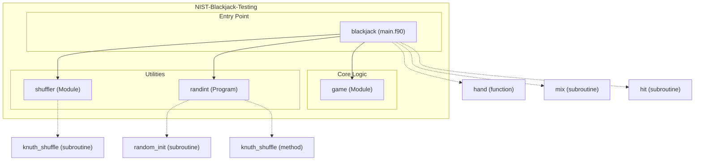

# NIST Blackjack Testing Repository - Test 8-27

## Overview

This repository contains an implementation and tests for a simplified Blackjack game written in Fortran, showcasing key functionalities like card shuffling, gameplay mechanics, and outcome determination. The core logic is designed with modularity in mind, including separate components for shuffling algorithms and reusable library functions. The Blackjack simulation supports debugging modes for development purposes and integrates randomized operations using the Knuth-Fisher-Yates shuffle algorithm. It also includes auxiliary tools for randomizing integer arrays, suitable for broader use cases like assigning random team orders.

## Key Features

- **Blackjack Gameplay Logic**: Implements a simplified Blackjack game with modules for handling player and dealer turns, bust conditions, and game outcomes.
- **Deck Shuffling**: Utilizes Knuth-Fisher-Yates algorithm for randomizing card decks, ensuring fair gameplay and test reliability.
- **Debug Mode**: Provides an optional debug mode for manual card control and testing specific scenarios.
- **Random Integer Operations**: Includes auxiliary functionality for randomizing integer arrays, supporting broader applications beyond Blackjack.
- **Cross-Module Integration**: Modular design with shared methods enabling independent testing and enhanced readability.
- **Testing Suite**: Contains Python and CMake-based test frameworks to validate core functionalities such as card hitting logic and shuffle consistency.

# Layout and Architecture
```
└── 942a6253-0a9a-4f87-b6d5-c42577a05b93
    └── NIST-Blackjack-Testing
        ├── .github
        │   └── workflows
        │       └── ci.yml                # CI configuration (auto-build/tests)
        ├── CMakeLists.txt                # Build system support (CMake)
        ├── CMakePresets.json             # Predefined CMake settings
        ├── LICENSE                       # Project license
        ├── app                           # Main programs
        │   ├── main.f90                  # Entry point for Blackjack simulation
        │   └── rand_order.f90            # Script for randomizing integers
        ├── fpm.toml                      # Fortran Package Manager config
        ├── meson.build                   # Build system support (Meson)
        ├── src                           # Source modules
        │   ├── blackjack.c               # C implementation (likely for testing or interop)
        │   ├── blackjack.f90             # Core Blackjack module logic
        │   └── shuffler.f90              # Module for Knuth shuffle algorithm
        └── tests                         # Test scripts and files
            ├── test_hit.cmake            # CMake script for testing `hit`
            ├── test_hit.py               # Python-based test script for `hit`
            └── y.asc                     # Test data (possibly card-related constants)
```




## Usage Examples

### Build

To build the game, create a build directory, configure the build system using CMake, and compile the source code:
```
mkdir build
cd build
cmake ..
make
```

### Test

Run the full suite of tests to verify the Blackjack functionality:
```
ctest
```

Alternatively, use Python's test framework to execute specific tests:
```
pytest tests/test_hit.py
```

### Run

#### Blackjack Simulation
Run the Blackjack game simulation with the default mode:
```
./f_blackjack
```

Enable debugging mode for manual card input:
```
./f_blackjack -d
```

#### Random Integer Shuffle
Generate and shuffle a list of integers for random assignments:
```
./rand_order 50
```
This will create a random permutation of integers from `1` to `50`.

#### C Interoperability
Run the Blackjack simulation implemented in C for interoperability testing:
```
./c_blackjack
```


# Key Feature Implementation Deep Dive

## 1. Blackjack Game Logic (`blackjack.f90`)
The `game` module in `blackjack.f90` provides core game mechanics for a simplified version of Blackjack. This module consists of the following key features:
- **`hand` Function**: Simulates a full Blackjack hand, encompassing:
  - Player and dealer actions (e.g., hitting, checking for blackjack, busting).
  - Conditional logic to determine game results — player win, dealer win, or push.
  - Integration with debugging functionality to manually provide card inputs in debug mode.
- **`hit` Subroutine**: Processes a single card draw for either the player or the dealer by updating their total and the number of aces actively treated as 11 points. If the total exceeds 21, aces are demoted back to 1 point.
- **`mix` Subroutine**: Initializes a standard deck of 52 cards and shuffles it using the Knuth shuffle algorithm (imported from the `shuffler` module).

Strengths:
- Effective card handling for realistic Blackjack scenarios, such as multiple aces and five-card Charlie wins.
- Modular approach with reusable subroutines for hitting and deck initialization.

Relationships:
- Imports `knuth_shuffle` from the `shuffler` module.
- Utilized by the `main.f90` program to execute a Blackjack game round.

---

## 2. Card Shuffling via Knuth Algorithm (`shuffler.f90`)
The `shuffler` module implements the Knuth shuffle algorithm for randomizing arrays. This module features:
- **`knuth_shuffle` Subroutine**: Iteratively swaps elements in the array with randomly selected elements, ensuring an unbiased shuffle.

Implementation:
- Utilizes the `random_number` intrinsic function to generate random indices used in element swaps.
- Designed to operate generically on integer arrays, making it reusable beyond card shuffling.

Strengths:
- Lightweight and efficient implementation suitable for shuffling in various contexts.
- Complies with mathematical fairness in randomization.

Relationships:
- Imported by the `game` module in `blackjack.f90` and the `rand_order.f90` program.

---

## 3. Game Entry Point and Debugging Controls (`main.f90`)
The `main.f90` program serves as the entry point for the Blackjack simulation. Key attributes include:
- **Deck Initialization and Shuffling**: Invokes `mix` to generate and shuffle the card deck.
- **Game Logic Execution**: Calls `hand`, which processes the player's and dealer's actions and outcomes.
- **Debug Mode**: Enables manual card input by toggling the `debug` flag (checked by the `hit` function in `blackjack.f90`).

Workflow:
- Optionally accepts a `-d` flag via command-line arguments to enable debug mode.
- Automatically initializes the random number generator (`random_init`) for shuffling and other stochastic operations.

Strengths:
- Provides a simple interface for running the core game logic.
- Debugging capability can be useful for testing custom card distributions.

Weaknesses:
- Limited extensibility for advanced game features, such as multiple hands or multiplayer support.

---

## 4. Random Integer Shuffle Utility (`rand_order.f90`)
This standalone program facilitates the shuffling of integers for applications like randomizing team orders. Features include:
- **Command-Line Integration**: Accepts the maximum integer (`N`) as input and generates a list of integers from 1 to `N` for shuffling.
- **Knuth Shuffle Utilization**: Internal array shuffle is performed using the `knuth_shuffle` subroutine from the `shuffler` module.

Strengths:
- Highly reusable utility for tasks requiring integer randomization.
- Simplistic design, adhering to the Unix philosophy of modularity.

Weaknesses:
- Minimal error handling for edge cases. For instance, the program exits if `N < 1` or an invalid command-line argument is passed.

Relationships:
- Shares the `knuth_shuffle` implementation with the `game` module.

---

## Summary
The NIST-Blackjack-Testing repo provides a modular and well-structured implementation of a Blackjack game, randomization algorithms, and utility programs. Future improvements could include:
- Extending game logic for advanced Blackjack rules (e.g., splitting hands, insurance).
- Enhancing shuffle accuracy with advanced randomization techniques or hardware RNG compatibility.
- Incorporating comprehensive error handling in standalone utilities.


# Implemented User Stories

## Blackjack Gameplay
- [ ] As a casual player, I want to play a hand of Blackjack, so that I can enjoy the game, which requires an initialized deck and proper rules for player and dealer actions.
- [ ] As a developer, I want to manually input cards during gameplay, so that I can test specific scenarios, which requires a debug mode option.
- [ ] As a competitive player, I want clear feedback on the game's results (e.g., win, loss, push, etc.), so that I can track my performance during gameplay, which requires result handling logic in the Blackjack module.
- [ ] As a new player, I want automatic handling of aces in my hand, so that I don't bust if treating an ace as 11 exceeds 21, which requires proper ace adjustment logic in the `hit` functionality.

## Card Deck Management
- [ ] As a rule enforcer, I want a standard deck of cards (52 cards) initialized for the game, so that the gameplay complies with Blackjack rules, which requires the `mix` subroutine for deck creation.
- [ ] As an administrator, I want the deck shuffled randomly before each game, so that the player's experience is fair, which requires implementation of the Knuth shuffle algorithm.
- [ ] As a developer, I want to visualize the shuffled deck, so that I can debug the randomization, which requires printing the shuffled deck during debug mode.
- [ ] As a statistician, I want the deck shuffling algorithm (Knuth shuffle) documented, so that I can verify the randomness statistically, which requires clear comments and references in the `shuffler` module.

## Game Testing & Debugging
- [ ] As a tester, I want a debugging mode to be enabled via a command-line argument, so that I can focus on edge case testing, which requires processing of the `argv` flag in `main.f90`.
- [ ] As a QA engineer, I want results of each hand (player win, dealer win, or push) to be displayed clearly, so that edge cases (like busts) are verifiable, which requires defining output formats in `hand`.
- [ ] As a testing specialist, I want a script to shuffle an array of test integers, so that I can independently verify the Knuth shuffle logic, which requires implementation in `rand_order.f90`.
- [ ] As an engineer, I want clear error messages if required inputs (e.g., maximum integer in `rand_order.f90`) are missing, so that debugging is easier, which requires input validation code.

## Program Initialization
- [ ] As a user, I want the random initialization logic to be handled automatically, so that gameplay and shuffling begin without manual intervention, which requires setup in `main.f90`.
- [ ] As a programmer, I want predefined seeding options for randomization, so that I can ensure reproducibility during tests, which requires integration of `random_init` in the code.

## Team Number Randomization
- [ ] As a coach, I want to assign randomized team numbers to players, so that pairing in games is fair, which requires `rand_order.f90` functionality to shuffle integers.
- [ ] As a data analyst, I want randomized integer sequences to be used, so that I can simulate random ordering for other applications, which requires generalization of the shuffling algorithm.
- [ ] As a participant, I want the result of integer randomization displayed, so that I can confirm my team's number assignment, which requires output formatting in `rand_order`.


# Dependencies


## Intrinsic

Standard Fortran intrinsic modules and functions.
- **iso_fortran_env**
  - `ALL`
- **iso_c_binding**
  - `c_int`
## Internal

Modules and functions defined within this project that are accessed in a different module or program.
- **shuffler**
  - `knuth_shuffle`
- **game**
  - `debug`
  - `hand`
  - `mix`
## External Functions

External (non-Fortran, bound with the C ABI) functions called by this project.
- `hit`
- `knuth_shuffle`
- `mix`
