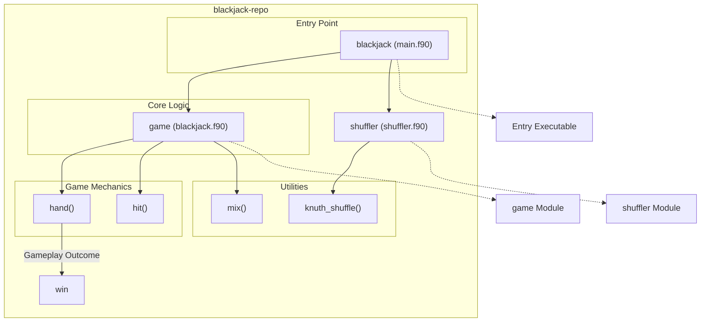

# NIST Blackjack PURR - TEST for Brett

## Overview

The **NIST Blackjack PURR** repository provides a comprehensive implementation of a simplified Blackjack game. Developed in Fortran with support for C bindings, the program simulates gameplay between a player and a dealer, incorporates card shuffling algorithms, and offers functionality for debugging and testing. Blackjack mechanics such as handling Aces, scoring, detecting busts, and determining winners are implemented in modular fashion for flexibility and efficiency. Additionally, the repository includes a standalone utility to shuffle integers, useful beyond the scope of the game itself.

This repository is ideal for learning card game logic, understanding the Knuth/Fisher-Yates shuffle algorithm, and experimenting with Fortran's interoperability features.

## Key Features

- **Simplified Blackjack Game**: Core gameplay mechanics including card dealing, hitting, and determining outcomes for player and dealer.
- **Knuth Shuffle Algorithm**: Efficient random shuffling of card decks, implemented with compatibility for C bindings.
- **Debug Mode**: Enable manual card inputs to test and validate gameplay scenarios.
- **Standalone Integer Shuffle Utility**: Program to randomly shuffle integers for practical use cases like generating team orders.
- **Modular Structure**: Organized source files for easy navigation and extension of game logic.
- **CMake and Meson Support**: Build system compatibility for streamlined compilation and testing.
- **Test Suite**: Includes Python and CMake tests to validate core functionality and edge cases.

# Layout and Architecture
```
└── a591a0c2-5971-4703-bec8-576e08fb94a2
    └── NIST-Blackjack-PURR
        ├── .github
        │   └── workflows
        │       └── ci.yml              # CI/CD pipeline configuration
        ├── CMakeLists.txt              # CMake build configuration
        ├── CMakePresets.json           # CMake preset configurations
        ├── LICENSE                     # Project license information
        ├── app                         # Application entry-point programs
        │   ├── main.f90                # Main Blackjack gameplay logic
        │   └── rand_order.f90          # Utility for shuffling integer sequences
        ├── fpm.toml                    # Fortran Package Manager configuration
        ├── meson.build                 # Meson build configuration
        ├── src                         # Core modules and logic
        │   ├── blackjack.c             # C bindings for game logic (likely used by Fortran)
        │   ├── blackjack.f90           # Core Blackjack game mechanics
        │   └── shuffler.f90            # Knuth shuffle algorithm implementation
        └── tests                       # Testing scripts and data
            ├── test_hit.cmake          # CMake script for testing the 'hit' functionality
            ├── test_hit.py             # Python script for testing the 'hit' function
            └── y.asc                   # Test data or configuration
```




## Usage Examples

### Build

This project uses CMake to configure and build the executables. Use the following commands:

```bash
mkdir build
cd build
cmake ..
make
```

This will generate three executables:
- `f_blackjack`: The main Blackjack game.
- `c_blackjack`: C-based version of the game (if implementing C bindings).
- `rand_order`: Utility program to shuffle integers.

### Run

1. **Run the Blackjack game:**
   Run the game in normal mode:
   ```bash
   ./f_blackjack
   ```
   Run the game with debug mode enabled:
   ```bash
   ./f_blackjack -d
   ```

2. **Run the integer shuffler utility:**
   Generate and shuffle integers from 1 to N:
   ```bash
   ./rand_order <N>
   ```
   Replace `<N>` with the maximum integer value.

### Test

Two methods exist for testing:

1. **Using the Python test script (`test_hit.py`):**
   Example command:
   ```bash
   python3 tests/test_hit.py ./f_blackjack
   ```

2. **Using CMake integrated testing (`test_hit.cmake`):**
   Run all tests using `ctest`:
   ```bash
   ctest
   ```

   Ensure the executable to be tested is listed in the `CMakeLists.txt` file.

### Debug

Enable debug mode in the Blackjack game by passing the `-d` flag:
```bash
./f_blackjack -d
```

This mode allows inspecting card shuffles and interaction steps in the gameplay.


### **Feature: hand (blackjack.f90)**

#### **Purpose**
The `hand` function simulates a game round of Blackjack between a player and the dealer. It determines the winner by evaluating game rules such as hitting, busting, and checking for blackjack conditions.

#### **Implementation Details**
1. The player and dealer are alternately dealt two cards each at the start of the game using the `hit` subroutine. Cards are fetched and counted dynamically while maintaining a running total of Ace values.
2. The dealer's card is revealed to the player, and the player is prompted to hit or stay based on their current score.
3. Multiple conditions are checked:
   - Player or dealer reaching 21 triggers a win (or push).
   - Player busting leads to an automatic loss.
   - Dealer hitting above 16 is mandated to stand. Any bust leads to a player win.
4. Results include Player Win (1), Push (2), and Dealer Win (0).

#### **Integration in Repository**
The `hand` routine acts as the main game evaluator, handling significant gameplay logic and interacting with the `hit` and `mix` routines to manage card decks and dealings.


### **Feature: hit (blackjack.f90)**

#### **Purpose**
Handles mechanics of drawing a new card for a player or dealer. Updates their total score and adjusts for Ace flexibility (1 or 11).

#### **Implementation Details**
1. Cards are drawn sequentially from the given deck (`cards` array).
2. When an Ace is drawn, it increments an `aces` counter to track its dynamic value.
3. If the total exceeds 21, the routine adjusts Ace values from 11 to 1 to prevent busting.
4. Debug mode allows manual card input for testing and further debugging gameplay mechanics.

#### **Integration in Repository**
The `hit` subroutine is a vital helper for the `hand` routine, facilitating iterative gameplay by enabling card draws.


### **Feature: mix (blackjack.f90)**

#### **Purpose**
Manages initialization and shuffling of a standard 52-card deck. It leverages the `knuth_shuffle` subroutine from the `shuffler` module.

#### **Implementation Details**
1. Initializes `cards` with 52 values representing a traditional deck, including multiple face cards and Aces.
2. Calls the `knuth_shuffle` algorithm to randomize this deck in place.

#### **Integration in Repository**
The `mix` routine is called at the beginning of the game to prepare a randomized deck for gameplay. Its effectiveness is critical to ensuring fairness and unpredictability in the game.


### **Feature: knuth_shuffle (shuffler.f90)**

#### **Purpose**
Implements the Knuth (Fisher-Yates) Shuffle for efficiently randomizing the elements of an array.

#### **Implementation Details**
1. Iterates backward through the input array, swapping the current element with a random element up to that index.
2. The random index is calculated using `random_number` scaled to the current size of the remaining unshuffled array.

#### **Integration in Repository**
The `knuth_shuffle` routine is a utility used by `mix` to shuffle the deck of cards. It ensures unbiased randomization, contributing to the fairness of the Blackjack game mechanics.


# Implemented User Stories

## Blackjack Game Mechanics
- [ ] **As a player, I want to draw cards, so that I can try to achieve a total as close as possible to 21, which requires card-dealing rules and score calculation.**
- [ ] **As a player, I want the ability to choose between hitting or staying, so that I can decide whether to risk drawing more cards, which requires user input during the game.**
- [ ] **As a dealer, I want to automatically draw cards until reaching a score of 17 or higher, so that the dealer's gameplay follows standard rules, which requires AI decision-making based on scores.**
- [ ] **As a player, I want automatic detection of Blackjack, so that I know immediately if I win with my dealt cards, which requires a scoring system that checks for 21.**
- [ ] **As a player, I want to know if I "bust" when my score exceeds 21, so that I understand I have lost the round, which requires immediate feedback upon exceeding the limit.**
- [ ] **As a player, I want to win automatically if the dealer busts, so that I know the round ends in my favor, which requires the dealer's score to be evaluated properly.**
- [ ] **As a player, I want the game to detect a "push" (tie) automatically, so that the outcome of the game is clear, which requires comparison of final scores.**
- [ ] **As a user, I want to play multiple consecutive games, so that I can continue enjoying the experience, which requires resetting the game state after each round.**

## Deck Shuffling
- [ ] **As a game administrator, I want to shuffle the deck of cards randomly before each game, so that each game is fair and unpredictable, which requires an implementation of the Knuth Shuffle algorithm.**
- [ ] **As a player, I want a shuffled deck that adheres to standard Blackjack composition, so that I know the deck contains all expected cards, which requires proper initialization of the deck before shuffling.**

## Debugging and Customization
- [ ] **As a developer, I want to enable debug mode, so that I can manually input card values for testing, which requires a command-line argument to toggle debug settings.**

## Randomized Integer Sequencing
- [ ] **As a user, I want the ability to shuffle a list of integers in random order, so that I can create randomized sequences (e.g., team orders), which requires an independent utility program for integer shuffling.**
- [ ] **As a developer, I want to initialize a random number generator with specific seeds, so that I can ensure consistent results for debugging, which requires proper RNG setup.**

## Testing
- [ ] **As a developer, I want automated tests for specific game functionalities, so that I can verify my implementation works as intended, which requires a compatible testing framework.**
- [ ] **As a developer, I want test data files, so that I can provide predefined inputs for simulation, which requires structured input files for testing scenarios.**

# Dependencies


## Intrinsic

Standard Fortran intrinsic modules and functions.
- **iso_fortran_env**
  - `ALL`
- **iso_c_binding**
  - `c_int`
## Internal

Modules and functions defined within this project that are accessed in a different module or program.
- **shuffler**
  - `knuth_shuffle`
- **game**
  - `debug`
  - `hand`
  - `mix`
## External Functions

External (non-Fortran, bound with the C ABI) functions called by this project.
- `hit`
- `knuth_shuffle`
- `mix`
