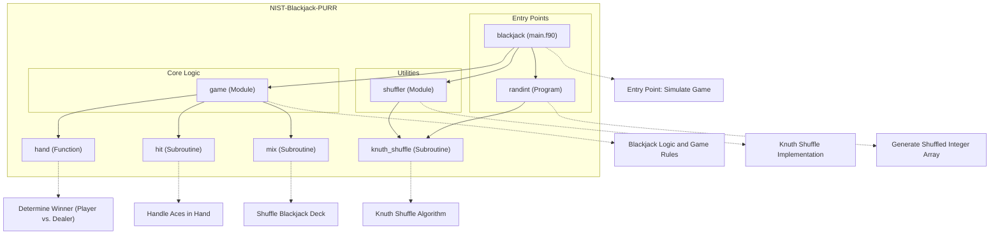

# NIST Blackjack PURR - This is a test

This repository provides an implementation of a simplified version of the card game Blackjack, designed for educational purposes and for demonstrating key programming concepts in Fortran. The program simulates a game of Blackjack with functionalities such as deck shuffling, handling player and dealer hands, and determining game outcomes. It employs the Knuth shuffle algorithm to randomize cards and includes debugging options for gameplay analysis. The project is structured to demonstrate modular code organization and includes comprehensive tests to validate core functions.

## Key Features

- **Blackjack Game Simulation**: Implements a full game of Blackjack with basic rules, including player actions (hit or stand) and dealer logic.
- **Deck Shuffling**: Utilizes the Knuth shuffle algorithm for efficient and unbiased shuffling of a standard 52-card deck.
- **Debugging Mode**: Includes a debug option to manually input cards for testing and analysis purposes.
- **Modular Implementation**: The project is divided into multiple modules and programs to enhance clarity and maintainability.
- **Interoperable Algorithms**: Features Fortran-C interoperability for the Knuth shuffle algorithm.
- **Customizable Integer List Shuffling**: Additional functionality for generating and shuffling integer lists of custom sizes.
- **Comprehensive Testing**: Includes unit tests to validate critical functions like card handling and shuffling.

# Layout and Architecture
```
└── a6c0d977-6adc-4f6f-a9b2-4e30b912c504
    └── NIST-Blackjack-PURR
        ├── .github
        │   └── workflows
        │       └── ci.yml            # CI pipeline configuration.
        ├── CMakeLists.txt            # CMake build configuration.
        ├── CMakePresets.json         # CMake presets for build setup.
        ├── LICENSE                   # License information.
        ├── README.md                 # Project documentation and overview.
        ├── app                       # Contains main programs.
        │   ├── main.f90              # Main Blackjack simulation program.
        │   └── rand_order.f90        # Randomized integer generator and shuffler.
        ├── fpm.toml                  # Fortran Package Manager config.
        ├── meson.build               # Meson build configuration.
        ├── src                       # Source code for core modules.
        │   ├── blackjack.c           # C interop for Blackjack implementation.
        │   ├── blackjack.f90         # Blackjack game logic (Fortran).
        │   └── shuffler.f90          # Knuth shuffle algorithm in Fortran.
        └── tests                     # Test files and configurations.
            ├── test_hit.cmake        # CMake test for the "hit" subroutine.
            ├── test_hit.py           # Python test for the "hit" subroutine.
            └── y.asc                 # Auxiliary test file (purpose unclear).
```




## Usage Examples

### Build

Build the programs using CMake:
```sh
cmake -B build
cmake --build build
```

This will produce the following executables in the `build/` directory:
- `f_blackjack`: Fortran version of the Blackjack game.
- `c_blackjack`: C interoperability version of the Blackjack game.
- `rand_order`: Utility to generate and shuffle integers.

---

### Run

#### Run the Fortran Blackjack game

To play the simplified Blackjack game:
```sh
./build/f_blackjack
```

Enable debug mode to manually input the next card:
```sh
./build/f_blackjack -d
```

#### Run the C Blackjack game

To play the C interoperability version:
```sh
./build/c_blackjack
```

#### Run the randomized integer generator

Generate and shuffle integers:
```sh
./build/rand_order <max_integer>
```
Example:
```sh
./build/rand_order 10
```
This generates and shuffles integers from 1 to 10.

---

### Test

#### Run tests using CMake
```sh
ctest
```
This uses the `test_hit.cmake` script to execute tests on the compiled executables.

#### Run tests using Python
To test a specific executable:
```sh
python3 tests/test_hit.py <path_to_executable>
```
Example for `f_blackjack`:
```sh
python3 tests/test_hit.py build/f_blackjack
```
This Python test invokes the executable, provides user input (`y
`), and asserts successful execution.

---


### Key Feature Implementation Deep Dive

#### 1. **Hand Functionality**
The `hand` function, defined in the `blackjack.f90` file, is the cornerstone of the blackjack game mechanics. It simulates the main loop of the game, encapsulating the actions of both the player and the dealer. Key steps include:
- Initializing player (`P`) and dealer (`D`) hands as well as the index (`i`) for card retrieval.
- Handling initial card draws using the `hit` subroutine for both the player and dealer.
- Taking user input to decide whether the player should "Hit" (draw a card) or "Stand" (retain the current score).
- Comparing scores and busts (exceeding 21 points) dynamically, ensuring a realistic flow of Blackjack rules.
This feature integrates tightly with the `hit` subroutine to manage card draws and ace adjustments efficiently.

---

#### 2. **Hit Subroutine**
The `hit` subroutine, also defined in `blackjack.f90`, encapsulates the logic for drawing cards and adjusting scores:
- Adds the next card from the deck to a given player’s total score.
- Handles ace adjustments effectively. If the score exceeds 21 and a player holds an ace counted as `11`, the subroutine decreases the ace's value to `1`.
- Manages debugging mode, allowing manual card input for testing scenarios.
This subroutine is invoked by both the player and dealer actions in the `hand` function, orchestrating the dynamic gameplay.

---

#### 3. **Knuth Shuffle Implementation**
The `knuth_shuffle` subroutine in `shuffler.f90` utilizes the Fisher-Yates algorithm to shuffle the deck of cards (array). Key implementation details:
- Iterates over the array in reverse, swapping elements randomly.
- Invokes `random_number(r)` to generate randomness for index selection during swaps.
- Modifies the array in place, supporting efficient integration with both the `mix` subroutine and higher-level functions like `hand`.
This robust shuffling ensures fairness and unpredictability in gameplay.

---

#### 4. **Mix Subroutine**
The `mix` subroutine in `blackjack.f90` initializes the deck of cards and applies the `knuth_shuffle` subroutine for randomized shuffling:
- Populates an array with standard values representing a deck of cards (e.g., numerical values and face card scores).
- Calls `knuth_shuffle(cards)` to randomize the order of cards.
This subroutine highlights modularity by isolating deck initialization and shuffling logic from game mechanics.

---

#### 5. **Debug Mode (Command-Line Integration)**
The `main.f90` program introduces a debug mode, enhancing development and testing capabilities:
- Reads command-line arguments to activate debug mode (`argv == '-d'`).
- Enables manual input of cards during gameplay when enabled.
This feature supports robust testing scenarios by offering manual control over card inputs while leveraging the existing logic in `hand` and `hit`.

---

### Summary of Integration
Each of these key features is implemented with modular design principles:
- **Encapsulation**: Each subroutine or function handles a specific aspect of the game (e.g., card drawing, shuffling, or gameplay).
- **Interdependence**: Features interact seamlessly within the `game` module through consistent interfaces (e.g., shared arrays and logical flags).
- **Command-Line Customization**: Debug mode and other game settings integrate directly with the `main.f90` program for flexible execution scenarios.

This modular architecture ensures extensibility and maintainability, enabling developers to add or improve features with minimal friction.


# Implemented User Stories

## Blackjack Gameplay
- [ ] As a **player**, I want to play a simplified game of Blackjack, so that I can experience the card game in a programmatic environment, which requires simulating the player's and dealer's turns.
- [ ] As a **player**, I want the game to handle the logic for hits, busts, and winning conditions for both the player and dealer, so that the game flow reflects standard Blackjack rules, which requires managing card values and actions.
- [ ] As a **game reviewer**, I want the ability to debug the game by manually inputting cards as needed, so that I can test specific scenarios, which requires a debug mode.
- [ ] As a **player**, I want the dealer's actions to be automated according to Blackjack rules (e.g., hit until ≥17), so that manual intervention is not required, which requires implementing dealer logic.
- [ ] As a **player**, I want the game to automatically declare a winner if special conditions like a "Blackjack" or a five-card hand occur, so that the game ends as per standard rules, which requires rules for special conditions.

## Card Deck Management
- [ ] As a **dealer**, I want to initialize a standard deck of 52 cards with correct values, so that a proper Blackjack game can be started, which requires implementing deck initialization with card ranks and suits.
- [ ] As a **dealer**, I want the deck to be shuffled using a reliable algorithm, so that the card order is randomized and fair, which requires a Knuth (Fisher-Yates) shuffle implementation.

## Random Number Initialization
- [ ] As a **developer**, I want a portable way to initialize random number generation, so that I can avoid repeatability in shuffle mechanics, which requires functions for random initialization.

## Program Interfaces
- [ ] As a **CLI user**, I want to run a Blackjack game from the command line, so that I can play directly without requiring a GUI, which requires implementing the main program.
- [ ] As a **CLI user**, I want the option to pass a debug flag when invoking the game, so that I can enable debug mode as needed, which requires reading command-line arguments.

## Integer Shuffle Utility
- [ ] As a **programmer**, I want to shuffle a custom range of integers from 1 to N, so that I can generate randomized orders for scenarios like team assignments, which requires a standalone integer shuffling utility.
- [ ] As a **CLI user**, I want to specify the maximum integer N for shuffling, so that I can customize the size of the sequence, which requires reading input arguments in the utility.

## Debugging and Logging
- [ ] As a **Blackjack game developer**, I want intermediate steps like card draws and totals output to stdout, so that I can follow and debug the gameplay process, which requires print statements for game actions.
- [ ] As a **user**, I want clear and user-friendly prompts during gameplay, so that I can understand and perform actions without confusion, which requires formatted input/output in the program.

## Parallel and Seeded Randomization
- [ ] As a **developer**, I want the ability to initialize the random number generator with a seed or parallel settings, so that I can have deterministic or distributed outputs for testing or specific use cases, which requires argument support for random initialization.


# Dependencies


## Intrinsic

Standard Fortran intrinsic modules and functions.
- **iso_fortran_env**
  - `ALL`
- **iso_c_binding**
  - `c_int`
## Internal

Modules and functions defined within this project that are accessed in a different module or program.
- **shuffler**
  - `knuth_shuffle`
- **game**
  - `debug`
  - `hand`
  - `mix`
## External Functions

External (non-Fortran, bound with the C ABI) functions called by this project.
- `hit`
- `knuth_shuffle`
- `mix`
